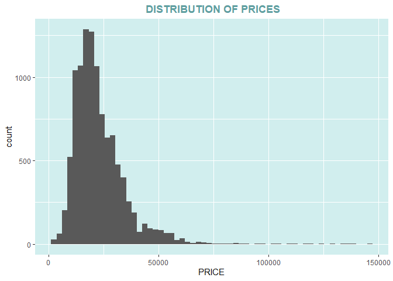
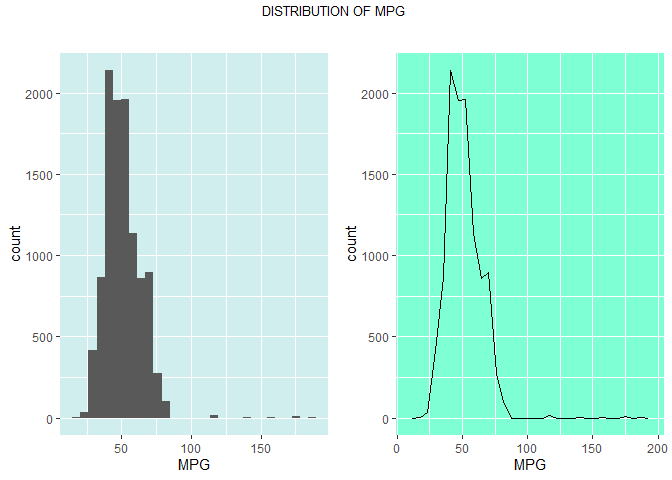

PREDICTING CAR PRICES USING MULTIPLE LINEAR REGRESSION
================
kipngenokoech
7/11/2021

The first step in
any machine learning task is to load the required libraries into our
environment using the function library.If you have not installed the
libraries use the function *install.packages()*.
``` r
#IMPORTING PACKAGES
library(gridExtra) # grid layouts
library(pastecs) # details summary stats
library(ggplot2) # visualizations
library(gmodels) # build contingency tables
library(psych)
library(caret)
library(car)
library(GGally)
library(tidyverse)
library(grid)
library(plyr)
```

``` r
#Reading in files and having a check on the data.
audi<-read.csv("audi.csv")
summary(audi)
```

    ##     model                year          price        transmission      
    ##  Length:10668       Min.   :1997   Min.   :  1490   Length:10668      
    ##  Class :character   1st Qu.:2016   1st Qu.: 15131   Class :character  
    ##  Mode  :character   Median :2017   Median : 20200   Mode  :character  
    ##                     Mean   :2017   Mean   : 22897                     
    ##                     3rd Qu.:2019   3rd Qu.: 27990                     
    ##                     Max.   :2020   Max.   :145000                     
    ##     mileage         fuelType              tax           mpg        
    ##  Min.   :     1   Length:10668       Min.   :  0   Min.   : 18.90  
    ##  1st Qu.:  5969   Class :character   1st Qu.:125   1st Qu.: 40.90  
    ##  Median : 19000   Mode  :character   Median :145   Median : 49.60  
    ##  Mean   : 24827                      Mean   :126   Mean   : 50.77  
    ##  3rd Qu.: 36465                      3rd Qu.:145   3rd Qu.: 58.90  
    ##  Max.   :323000                      Max.   :580   Max.   :188.30  
    ##    engineSize   
    ##  Min.   :0.000  
    ##  1st Qu.:1.500  
    ##  Median :2.000  
    ##  Mean   :1.931  
    ##  3rd Qu.:2.000  
    ##  Max.   :6.300

``` r
str(audi)
```

    ## 'data.frame':    10668 obs. of  9 variables:
    ##  $ model       : chr  " A1" " A6" " A1" " A4" ...
    ##  $ year        : int  2017 2016 2016 2017 2019 2016 2016 2016 2015 2016 ...
    ##  $ price       : int  12500 16500 11000 16800 17300 13900 13250 11750 10200 12000 ...
    ##  $ transmission: chr  "Manual" "Automatic" "Manual" "Automatic" ...
    ##  $ mileage     : int  15735 36203 29946 25952 1998 32260 76788 75185 46112 22451 ...
    ##  $ fuelType    : chr  "Petrol" "Diesel" "Petrol" "Diesel" ...
    ##  $ tax         : int  150 20 30 145 145 30 30 20 20 30 ...
    ##  $ mpg         : num  55.4 64.2 55.4 67.3 49.6 58.9 61.4 70.6 60.1 55.4 ...
    ##  $ engineSize  : num  1.4 2 1.4 2 1 1.4 2 2 1.4 1.4 ...

``` r
head(audi)#checking the first 6 rows
```

    ##   model year price transmission mileage fuelType tax  mpg engineSize
    ## 1    A1 2017 12500       Manual   15735   Petrol 150 55.4        1.4
    ## 2    A6 2016 16500    Automatic   36203   Diesel  20 64.2        2.0
    ## 3    A1 2016 11000       Manual   29946   Petrol  30 55.4        1.4
    ## 4    A4 2017 16800    Automatic   25952   Diesel 145 67.3        2.0
    ## 5    A3 2019 17300       Manual    1998   Petrol 145 49.6        1.0
    ## 6    A1 2016 13900    Automatic   32260   Petrol  30 58.9        1.4

The data has 10668 observations and 9 variables. Price is our target variable while model,year,transmission,mileage,fuel type,mpg and engine size are the predictor variables.

## EXPLORATORY DATA ANALYSIS

``` r
#checking if we have any NA values.
colSums(is.na(audi))
```

    ##        model         year        price transmission      mileage     fuelType 
    ##            0            0            0            0            0            0 
    ##          tax          mpg   engineSize 
    ##            0            0            0

The data has no missing values. Sometimes you may encounter a dataset with missing values and the best option is to estimate the missing fields. R has a package *mice* which gives us methods to impute missing values. The values are drawn from a distribution for each missing point.

``` r
# function to tranform variables to factors
to.factors <- function(df, variables){
  for (variable in variables){
    df[[variable]] <- as.factor(df[[variable]])
  }
  return(df)
}

categoricalvars<-c("model","transmission","fuelType","year","engineSize","tax")
audi<-to.factors(df=audi,variables = categoricalvars)
str(audi)
```

    ## 'data.frame':    10668 obs. of  9 variables:
    ##  $ model       : Factor w/ 26 levels " A1"," A2"," A3",..: 1 6 1 4 3 1 6 4 3 1 ...
    ##  $ year        : Factor w/ 21 levels "1997","1998",..: 18 17 17 18 20 17 17 17 16 17 ...
    ##  $ price       : int  12500 16500 11000 16800 17300 13900 13250 11750 10200 12000 ...
    ##  $ transmission: Factor w/ 3 levels "Automatic","Manual",..: 2 1 2 1 2 1 1 2 2 2 ...
    ##  $ mileage     : int  15735 36203 29946 25952 1998 32260 76788 75185 46112 22451 ...
    ##  $ fuelType    : Factor w/ 3 levels "Diesel","Hybrid",..: 3 1 3 1 3 3 1 1 3 3 ...
    ##  $ tax         : Factor w/ 37 levels "0","20","30",..: 9 2 3 8 8 3 3 2 2 3 ...
    ##  $ mpg         : num  55.4 64.2 55.4 67.3 49.6 58.9 61.4 70.6 60.1 55.4 ...
    ##  $ engineSize  : Factor w/ 19 levels "0","1","1.2",..: 4 9 4 9 2 4 9 9 4 4 ...

Before any machine learning task, an important step is to check how our
variables have been coded. We have to convert the following variables
into factors `model`,`transmission`,`year`,`fuelType`,`tax` and
`engineSize`.

### Data visualization

  - Factor variables

<!-- end list -->

``` r
 ggplot(audi,aes(model))+geom_bar()+labs(title='BARPLOT OF AUDI   MODELS',x='MODEL')+theme(panel.background = element_rect(fill = 'lightcyan2'),plot.title = element_text(hjust = 0.5,face = 'bold',colour = 'cadetblue'))+geom_text(stat='count', aes(label=..count..), vjust=-1)
```

<!-- -->

The plot above represents the count per each model .*A3* having the most
count followed by *A5* and *A2*. *RS7* has the least count.

``` r
ggplot(audi,aes(model,fill=fuelType))+geom_bar()+labs(title='MODEL COUNT W.R.T  FUEL TYPE',x='MODEL')+theme(panel.background = element_rect(fill = 'lightcyan2'),plot.title = element_text(hjust = 0.5,face = 'bold',colour = 'cadetblue'),legend.background = element_rect(fill = 'lightcyan4'))
```

<!-- -->

A significant number of Audi use petrol followed by diesel and a
smaller percentage use hybrid. We can conclude also that the R model of
Audi cars use petrol only.

``` r
ggplot(audi,aes(model,fill=year))+geom_bar()+labs(title='COUNT PER  MODEL W.R.T YEAR',x='MODEL')+theme(panel.background = element_rect(fill = 'lightcyan2'),plot.title = element_text(hjust = 0.5,face = 'bold',colour = 'cadetblue'),legend.background = element_rect(fill = 'lightcyan4'))
```

<!-- -->

*2015-2020* Audi models have a greater significant number of cars in our
data.

``` r
ggplot(audi,aes(model,fill=engineSize))+geom_bar()+labs(title='COUNT PER  MODEL W.R.T ENGINE SIZE',x='MODEL')+theme(panel.background = element_rect(fill = 'lightcyan2'),plot.title = element_text(hjust = 0.5,face = 'bold',colour = 'cadetblue'),legend.background = element_rect(fill = 'lightcyan4'))
```

<!-- -->

Most of the Audi models run with engine sizes from 1 to 3, 2 taking the
highest proportion as shown above.

``` r
ggplot(audi,aes(model,fill=transmission))+geom_bar()+labs(title='COUNT PER  MODEL W.R.T TRANSMISSION',x='MODEL')+theme(panel.background = element_rect(fill = 'lightcyan2'),plot.title = element_text(hjust = 0.5,face = 'bold',colour = 'cadetblue'),legend.background = element_rect(fill = 'lightcyan4'))
```

<!-- -->

The Manual Audi model took the highest proportion followed by semi-auto
and lastly automatic. It also appears that R models are produced in
automatic and semi-auto transmission.

  - Numeric variables
    
    \*Histogram and frequency polygon

<!-- end list -->

``` r
ggplot(audi,aes(price))+geom_histogram(bins = 60)+labs(title=' DISTRIBUTION OF PRICES',x='PRICE')+theme(panel.background = element_rect(fill = 'lightcyan2'),plot.title = element_text(hjust = 0.5,face = 'bold',colour = 'cadetblue'))
```

<!-- -->

Histogram is used to illustrate the distribution of continuous
variables.From the above, prices are positively skewed or right skewed
this is because a large number of data values occur on the left side
with a fewer number of data values on the right side. It can also be
shown by a longer tail on the right side.

``` r
ggplot(audi,aes(price,col=fuelType))+geom_freqpoly(bins=50)+labs(title='FREQUENCY POLYGON OF CAR PRICES PER FUEL TYPE',x='Price')+theme(panel.background = element_rect(fill = 'lightcyan2'),plot.title = element_text(hjust = 0.5,face = 'bold',colour = 'cadetblue'),legend.background = element_rect(fill = 'lightcyan4'))
```

<!-- -->

The frequency polygon displays distribution of prices per fuel
type.Prices are positively skewed shown by the long tail towards the
right based on each fuel type.

``` r
ggplot(audi,aes(price,col=transmission))+geom_freqpoly(bins=50)+labs(title='FREQUENCY POLYGON OF CAR PRICES PER TRANSMISSION',x='Price')+theme(panel.background = element_rect(fill = 'lightcyan2'),plot.title = element_text(hjust = 0.5,face = 'bold',colour = 'cadetblue'),legend.background = element_rect(fill = 'lightcyan4'))
```

<!-- --> The
distribution of prices based on transmission is positively skewed as
shown by the the frequency polygon. A higher frequency of each
transmission range from approcimately $2200 to $35000.

``` r
p1<-ggplot(audi,aes(mpg))+geom_histogram()+labs(title='DISTRIBUTION OF  MPG',x='MPG')+theme(panel.background = element_rect(fill = 'lightcyan2'),plot.title = element_text(hjust = 0.5,face = 'bold',colour = 'cadetblue'))

p2<-ggplot(audi,aes(mpg))+geom_freqpoly()+labs(title='FREQUENCY POLYGON OF MPG',x='MPG')+theme(panel.background = element_rect(fill = 'aquamarine'),plot.title = element_text(hjust = 0.5,face = 'bold',colour = 'cadetblue'))

grid.arrange(p1 + ggtitle(""),
             p2 + ggtitle(""),
             nrow = 1,
             top = textGrob("DISTRIBUTION OF MPG ", 
                            gp=gpar(fontsize=10)))
```

<!-- -->

Both histogram and frequency polygon have shown that MPG is right-skewed
which is depicted by a longer tail on the right side of the plot.

``` r
options(scipen=10000)
ggplot(audi,aes(mileage))+geom_histogram()+labs(title='DISTRIBUTION OF MILLEAGE',x='MILEAGE')+theme(panel.background = element_rect(fill = 'lightcyan2'),plot.title = element_text(hjust = 0.5,face = 'bold',colour = 'cadetblue'))
```

<!-- -->

The distribution of mileage is highly skewed. A significant number of
values lie within the left side of the histogram making it a positively
skewed distribution.

\*BOXPLOTS

``` r
ggplot(audi,aes(transmission,price,fill=transmission))+geom_boxplot()+labs(title = 'PRICE W.R.T TRANSMISSION',x='TRANSMISSION',y='PRICE')+theme(panel.background = element_rect(fill = 'lightcyan2'),plot.title = element_text(hjust = 0.5,face = 'bold',colour = 'cadetblue'),legend.background = element_rect(fill = 'lightcyan3'))
```

<!-- -->

Automatic is expensive on average compared to manual and semi-automatic.

``` r
ggplot(audi,aes(transmission,price,fill=fuelType))+geom_boxplot()+labs(title = 'PRICE W.R.T TRANSMISSION AND FUEL TYPE',x='TRANSMISSION',y='PRICE')+theme(panel.background = element_rect(fill = 'lightcyan2'),plot.title = element_text(hjust = 0.5,face = 'bold',colour = 'cadetblue'),legend.background = element_rect(fill = 'lightcyan3'))
```

<!-- -->

From the boxplot above, Automatic models that consume petrol and diesel
have higher prices than hybrid. We do not have the hybrid manual
model. Hybrid semi-auto goes for higher prices compared to diesel and
petrol.

``` r
ggplot(audi,aes(year,price,fill))+geom_boxplot()+labs(title = 'PRICE W.R.T YEAR',x='YEAR',y='PRICE')+theme(panel.background = element_rect(fill = 'lightcyan2'),plot.title = element_text(hjust = 0.5,face = 'bold',colour = 'cadetblue'))
```

<!-- -->

The Audi Prices increases with the year of production. The car prices on
average increases as it tend to 2020.

``` r
ggplot(audi,aes(engineSize,price,fill=engineSize))+geom_boxplot() +labs(title = 'PRICE W.R.T ENGINE SIZE',x='ENGINE SIZE',y='PRICE')+theme(panel.background = element_rect(fill = 'lightcyan2'),plot.title = element_text(hjust = 0.5,face = 'bold',colour = 'cadetblue'),legend.background = element_rect(fill = 'lightcyan3'))
```

<!-- -->

From the pattern shown by the boxplot above,as engine size goes up the
prices also increase on average.

  - Relationship between variables

<!-- end list -->

``` r
ggplot(audi,aes(mileage,price))+geom_smooth(se=FALSE)+labs(title = 'R.B MILEAGE AND PRICE',x='MILEAGE',y='PRICE')+theme(panel.background = element_rect(fill='lightcyan'),plot.title = element_text(hjust = 0.5,face = 'bold',colour = 'cadetblue'))+geom_point()
```

<!-- -->

The scatter plot shows an inverse relationship between price and mileage
Which clearly shows a non-linear relationship.

``` r
ggplot(audi,aes(mpg,price))+geom_smooth(se=FALSE)+labs(title = 'R.B PRICE AND MPG',x='MPG',y='PRICE')+theme(panel.background = element_rect(fill = 'lightcyan2'),plot.title = element_text(hjust = 0.5,face = 'bold',colour = 'cadetblue'))
```

<!-- -->

A unit change in MPG does not result in the same change in PRICE which
makes the relationship between price and mpg non-linear.

``` r
ggplot(audi,aes(mpg,price,col=transmission))+geom_smooth(se=FALSE)+labs(title = 'R.B PRICE AND MPG W.R.T TRANSMISSION',x='MPG',y='PRICE')+theme(panel.background = element_rect(fill = 'lightcyan2'),plot.title = element_text(hjust = 0.5,face = 'bold',colour = 'cadetblue'),legend.background = element_rect(fill = 'cadetblue'))
```

<!-- -->

From the above plot, we can see that prices and MPG have a non linear
relationship with respect to transmission.

## DATA TRANFORMATION

``` r
normalize<-function(x){return((x-min(x))/(max(x)-min(x)))}
attach(audi)
audi$mileage<-normalize(audi$mileage)
audi$mpg<-normalize(audi$mpg)
```

## MODEL BUILDING

``` r
model<-lm(price~.,data = audi)
summary(model)
```

    ## 
    ## Call:
    ## lm(formula = price ~ ., data = audi)
    ## 
    ## Residuals:
    ##    Min     1Q Median     3Q    Max 
    ## -22662  -1734   -185   1465  33434 
    ## 
    ## Coefficients:
    ##                        Estimate Std. Error t value             Pr(>|t|)    
    ## (Intercept)            11476.54    3613.18   3.176             0.001496 ** 
    ## model A2                5319.20    3572.86   1.489             0.136575    
    ## model A3                2075.50     130.41  15.915 < 0.0000000000000002 ***
    ## model A4                1912.95     154.35  12.393 < 0.0000000000000002 ***
    ## model A5                3405.72     174.20  19.550 < 0.0000000000000002 ***
    ## model A6                4112.56     187.34  21.952 < 0.0000000000000002 ***
    ## model A7                3474.54     347.94   9.986 < 0.0000000000000002 ***
    ## model A8                7226.52     363.34  19.889 < 0.0000000000000002 ***
    ## model Q2                2070.01     159.48  12.980 < 0.0000000000000002 ***
    ## model Q3                3702.15     158.45  23.365 < 0.0000000000000002 ***
    ## model Q5                8017.47     197.83  40.528 < 0.0000000000000002 ***
    ## model Q7               12991.62     285.39  45.522 < 0.0000000000000002 ***
    ## model Q8               23646.04     446.33  52.979 < 0.0000000000000002 ***
    ## model R8               61457.65    1871.36  32.841 < 0.0000000000000002 ***
    ## model RS3               -773.23     852.88  -0.907             0.364630    
    ## model RS4              20049.40    2059.81   9.734 < 0.0000000000000002 ***
    ## model RS5              16564.11    2111.83   7.843 0.000000000000004805 ***
    ## model RS6              20720.85     710.01  29.184 < 0.0000000000000002 ***
    ## model RS7              10893.52    3378.69   3.224             0.001267 ** 
    ## model S3                7186.23     769.57   9.338 < 0.0000000000000002 ***
    ## model S4                6762.99     996.48   6.787 0.000000000012072754 ***
    ## model S5                4586.04    1856.85   2.470             0.013535 *  
    ## model S8                 564.19    1674.91   0.337             0.736237    
    ## model SQ5               9455.40     827.86  11.422 < 0.0000000000000002 ***
    ## model SQ7               9794.32    1196.35   8.187 0.000000000000000299 ***
    ## model TT                3811.96     232.47  16.398 < 0.0000000000000002 ***
    ## year1998                9783.59    4687.04   2.087             0.036878 *  
    ## year2002               19659.88    4809.79   4.087 0.000043932938111550 ***
    ## year2003                8631.06    3920.65   2.201             0.027727 *  
    ## year2004               12708.46    3731.40   3.406             0.000662 ***
    ## year2005               12597.43    3716.08   3.390             0.000702 ***
    ## year2006               15114.51    3687.92   4.098 0.000041915065965973 ***
    ## year2007               14408.41    3655.25   3.942 0.000081378976028167 ***
    ## year2008               14502.42    3637.69   3.987 0.000067447515786228 ***
    ## year2009               13004.72    3626.31   3.586             0.000337 ***
    ## year2010               11462.98    3589.70   3.193             0.001411 ** 
    ## year2011               12661.42    3583.96   3.533             0.000413 ***
    ## year2012               13050.22    3566.68   3.659             0.000255 ***
    ## year2013               13846.27    3564.00   3.885             0.000103 ***
    ## year2014               14550.28    3562.68   4.084 0.000044578388368755 ***
    ## year2015               16094.48    3563.33   4.517 0.000006349292691654 ***
    ## year2016               17295.56    3564.30   4.852 0.000001236944179996 ***
    ## year2017               19360.48    3566.31   5.429 0.000000058017476971 ***
    ## year2018               21280.76    3568.03   5.964 0.000000002535756692 ***
    ## year2019               24103.90    3568.46   6.755 0.000000000015064447 ***
    ## year2020               28145.13    3570.84   7.882 0.000000000000003541 ***
    ## transmissionManual     -1477.54      93.44 -15.812 < 0.0000000000000002 ***
    ## transmissionSemi-Auto     71.38      83.58   0.854             0.393113    
    ## mileage               -25842.79     753.75 -34.286 < 0.0000000000000002 ***
    ## fuelTypeHybrid         17560.47    1039.65  16.891 < 0.0000000000000002 ***
    ## fuelTypePetrol          -506.71     138.66  -3.654             0.000259 ***
    ## tax20                  -2486.20     213.62 -11.638 < 0.0000000000000002 ***
    ## tax30                  -3130.55     208.29 -15.030 < 0.0000000000000002 ***
    ## tax115                 -4715.87    3159.19  -1.493             0.135533    
    ## tax125                 -4105.86     247.76 -16.572 < 0.0000000000000002 ***
    ## tax135                  3082.62     906.99   3.399             0.000679 ***
    ## tax140                 -4332.63    1450.99  -2.986             0.002833 ** 
    ## tax145                 -3949.00     226.70 -17.419 < 0.0000000000000002 ***
    ## tax150                 -4190.97     238.35 -17.583 < 0.0000000000000002 ***
    ## tax155                 -7252.61    3240.61  -2.238             0.025239 *  
    ## tax160                 -5258.43     300.48 -17.500 < 0.0000000000000002 ***
    ## tax165                 -4891.66     437.12 -11.191 < 0.0000000000000002 ***
    ## tax190                 -4417.59    3164.83  -1.396             0.162792    
    ## tax195                 -8125.14    1627.92  -4.991 0.000000609869003267 ***
    ## tax200                 -6883.02     276.83 -24.864 < 0.0000000000000002 ***
    ## tax205                 -6654.71     383.55 -17.350 < 0.0000000000000002 ***
    ## tax220                -11497.21    2309.38  -4.978 0.000000650952581148 ***
    ## tax230                -12722.23    3249.92  -3.915 0.000091113790740517 ***
    ## tax235                 -7482.21     377.02 -19.846 < 0.0000000000000002 ***
    ## tax240                 -6705.97     604.10 -11.101 < 0.0000000000000002 ***
    ## tax260                 -9596.77     503.87 -19.046 < 0.0000000000000002 ***
    ## tax265                 -9142.39     859.22 -10.640 < 0.0000000000000002 ***
    ## tax280                -13279.67    2277.51  -5.831 0.000000005678595319 ***
    ## tax290                -21988.60    2445.18  -8.993 < 0.0000000000000002 ***
    ## tax295                -17932.64    4506.15  -3.980 0.000069494939715523 ***
    ## tax300                -12018.03     460.00 -26.126 < 0.0000000000000002 ***
    ## tax305                -12674.88     917.01 -13.822 < 0.0000000000000002 ***
    ## tax315                -24063.47    2449.88  -9.822 < 0.0000000000000002 ***
    ## tax325                -16184.35     678.83 -23.842 < 0.0000000000000002 ***
    ## tax330                -20698.19    1372.34 -15.082 < 0.0000000000000002 ***
    ## tax515                -45713.65    3692.71 -12.379 < 0.0000000000000002 ***
    ## tax535                -26489.05    3764.24  -7.037 0.000000000002085653 ***
    ## tax540                -21706.59    3248.84  -6.681 0.000000000024869343 ***
    ## tax555                -18335.55    1207.66 -15.183 < 0.0000000000000002 ***
    ## tax565                -19069.03    2321.03  -8.216 0.000000000000000235 ***
    ## tax570                -36773.23    1322.68 -27.802 < 0.0000000000000002 ***
    ## tax580                -52740.32    2485.65 -21.218 < 0.0000000000000002 ***
    ## mpg                   -29607.08    1360.95 -21.755 < 0.0000000000000002 ***
    ## engineSize1            -4978.60     462.99 -10.753 < 0.0000000000000002 ***
    ## engineSize1.2          -2335.12     727.22  -3.211             0.001327 ** 
    ## engineSize1.4          -2148.38     447.81  -4.798 0.000001628542429251 ***
    ## engineSize1.5          -3619.44     447.60  -8.086 0.000000000000000682 ***
    ## engineSize1.6          -3592.21     458.50  -7.835 0.000000000000005153 ***
    ## engineSize1.8          -2277.20     532.17  -4.279 0.000018928114586168 ***
    ## engineSize1.9          -3053.92    1749.64  -1.745             0.080934 .  
    ## engineSize2             -606.20     438.54  -1.382             0.166906    
    ## engineSize2.5          16406.52     781.61  20.991 < 0.0000000000000002 ***
    ## engineSize2.7          -3959.43    1942.64  -2.038             0.041558 *  
    ## engineSize2.9          10083.58    2120.38   4.756 0.000002005117063870 ***
    ## engineSize3             6224.63     471.47  13.202 < 0.0000000000000002 ***
    ## engineSize3.2           5288.68    1817.45   2.910             0.003622 ** 
    ## engineSize4            21622.61     601.80  35.930 < 0.0000000000000002 ***
    ## engineSize4.1           6193.66    2590.04   2.391             0.016805 *  
    ## engineSize4.2           5357.04    1464.57   3.658             0.000256 ***
    ## engineSize5.2          27802.27    1899.76  14.635 < 0.0000000000000002 ***
    ## engineSize6.3          37973.21    3457.81  10.982 < 0.0000000000000002 ***
    ## ---
    ## Signif. codes:  0 '***' 0.001 '**' 0.01 '*' 0.05 '.' 0.1 ' ' 1
    ## 
    ## Residual standard error: 3150 on 10562 degrees of freedom
    ## Multiple R-squared:  0.9284, Adjusted R-squared:  0.9277 
    ## F-statistic:  1305 on 105 and 10562 DF,  p-value: < 0.00000000000000022

## IMPROVING MODEL ACCURACY

``` r
#checking collinearity between mpg and mileage
X<-audi[,c(5,8)]
ggpairs(X)
```

<!-- -->

Mileage and mpg have a correlation of `0.395` which is low. High
correlation among predictors is the root course of collinearity.

``` r
#assumption about residuals

plot(model)
```

<!-- --><!-- --><!-- --><!-- -->

The diagnostic plot is fair. The dots are randomly placed around
horizontal line in the first plot, which clearly shows a constant
variance across residuals.

``` r
#checking non-linear relationship between price and mpg
mpg<-ggplot(audi,aes(mpg,price))+geom_point()
mpg2<-ggplot(audi,aes(mpg^2,price))+geom_point()
grid.arrange(mpg, mpg2, ncol=2)
```

<!-- -->

Squaring MPG results in a straight line pattern hence `MPG^2` is
appropriate for improving our model accuracy.

``` r
#checking non-linear relationship between price and mileage
mileage<-ggplot(audi,aes(mileage,price))+geom_point()
mileage2<-ggplot(audi,aes(mileage^2,price))+geom_point()
grid.arrange(mileage, mileage2, ncol=2)
```

<!-- -->

A straight line pattern is depicted by `mileage^2`.

## model building

``` r
audi$mileage2<-audi$mileage^2
audi$mpg2<-audi$mpg^2
model2<-lm(price~ model+year+transmission+mileage+mileage2+fuelType+tax+mpg+mpg2+engineSize,data=audi)

summary(model2)
```

    ## 
    ## Call:
    ## lm(formula = price ~ model + year + transmission + mileage + 
    ##     mileage2 + fuelType + tax + mpg + mpg2 + engineSize, data = audi)
    ## 
    ## Residuals:
    ##    Min     1Q Median     3Q    Max 
    ## -23529  -1718   -146   1445  33176 
    ## 
    ## Coefficients:
    ##                         Estimate Std. Error t value             Pr(>|t|)    
    ## (Intercept)            13876.479   3544.775   3.915   0.0000911124627518 ***
    ## model A2                5622.614   3501.408   1.606             0.108344    
    ## model A3                1882.844    128.209  14.686 < 0.0000000000000002 ***
    ## model A4                1824.511    151.381  12.052 < 0.0000000000000002 ***
    ## model A5                3347.694    170.741  19.607 < 0.0000000000000002 ***
    ## model A6                3895.153    183.909  21.180 < 0.0000000000000002 ***
    ## model A7                3306.351    341.054   9.695 < 0.0000000000000002 ***
    ## model A8                6957.965    356.374  19.524 < 0.0000000000000002 ***
    ## model Q2                1642.297    157.717  10.413 < 0.0000000000000002 ***
    ## model Q3                3034.225    159.121  19.069 < 0.0000000000000002 ***
    ## model Q5                7021.994    200.669  34.993 < 0.0000000000000002 ***
    ## model Q7               11849.691    286.049  41.425 < 0.0000000000000002 ***
    ## model Q8               22129.769    444.151  49.825 < 0.0000000000000002 ***
    ## model R8               59945.936   1835.215  32.664 < 0.0000000000000002 ***
    ## model RS3              -1099.070    835.964  -1.315             0.188628    
    ## model RS4              19260.719   2018.816   9.541 < 0.0000000000000002 ***
    ## model RS5              15915.973   2069.778   7.690   0.0000000000000161 ***
    ## model RS6              19715.691    697.529  28.265 < 0.0000000000000002 ***
    ## model RS7              10271.504   3310.939   3.102             0.001925 ** 
    ## model S3                6741.269    754.602   8.934 < 0.0000000000000002 ***
    ## model S4                6379.450    976.728   6.531   0.0000000000681330 ***
    ## model S5                4193.485   1819.629   2.305             0.021209 *  
    ## model S8                -346.103   1641.872  -0.211             0.833049    
    ## model SQ5               8474.279    812.705  10.427 < 0.0000000000000002 ***
    ## model SQ7               8828.166   1173.355   7.524   0.0000000000000575 ***
    ## model TT                3570.902    228.258  15.644 < 0.0000000000000002 ***
    ## year1998               11205.600   4595.982   2.438             0.014780 *  
    ## year2002               20020.598   4713.392   4.248   0.0000217926152770 ***
    ## year2003               10614.428   3843.075   2.762             0.005755 ** 
    ## year2004               14260.419   3657.470   3.899   0.0000971947414109 ***
    ## year2005               14575.518   3642.878   4.001   0.0000634792153405 ***
    ## year2006               17012.401   3615.660   4.705   0.0000025683868354 ***
    ## year2007               16069.735   3582.694   4.485   0.0000073553549479 ***
    ## year2008               15633.083   3566.267   4.384   0.0000117863703669 ***
    ## year2009               15555.564   3555.994   4.374   0.0000122899502452 ***
    ## year2010               13616.903   3520.531   3.868             0.000110 ***
    ## year2011               15575.855   3515.403   4.431   0.0000094853920358 ***
    ## year2012               16395.758   3500.046   4.684   0.0000028422871981 ***
    ## year2013               17310.143   3497.792   4.949   0.0000007579508587 ***
    ## year2014               17977.789   3496.367   5.142   0.0000002769208832 ***
    ## year2015               19633.720   3497.111   5.614   0.0000000202381178 ***
    ## year2016               20901.712   3498.103   5.975   0.0000000023729220 ***
    ## year2017               23012.425   3499.945   6.575   0.0000000000509228 ***
    ## year2018               24643.500   3500.686   7.040   0.0000000000020474 ***
    ## year2019               26236.426   3498.687   7.499   0.0000000000000695 ***
    ## year2020               30270.262   3500.875   8.646 < 0.0000000000000002 ***
    ## transmissionManual     -1388.784     91.753 -15.136 < 0.0000000000000002 ***
    ## transmissionSemi-Auto    103.725     81.923   1.266             0.205497    
    ## mileage               -33884.263   1436.565 -23.587 < 0.0000000000000002 ***
    ## mileage2               24206.656   3622.111   6.683   0.0000000000245861 ***
    ## fuelTypeHybrid         -2999.352   1449.950  -2.069             0.038609 *  
    ## fuelTypePetrol         -1844.648    151.953 -12.140 < 0.0000000000000002 ***
    ## tax20                  -1979.205    210.833  -9.388 < 0.0000000000000002 ***
    ## tax30                  -2652.330    205.448 -12.910 < 0.0000000000000002 ***
    ## tax115                 -4787.858   3095.732  -1.547             0.121990    
    ## tax125                 -3720.815    243.470 -15.282 < 0.0000000000000002 ***
    ## tax135                 14949.227   1073.092  13.931 < 0.0000000000000002 ***
    ## tax140                  1150.883   1447.988   0.795             0.426739    
    ## tax145                 -3737.243    222.436 -16.801 < 0.0000000000000002 ***
    ## tax150                 -3998.429    233.760 -17.105 < 0.0000000000000002 ***
    ## tax155                 -6858.941   3175.539  -2.160             0.030801 *  
    ## tax160                 -5164.399    294.545 -17.533 < 0.0000000000000002 ***
    ## tax165                 -4812.934    428.365 -11.236 < 0.0000000000000002 ***
    ## tax190                 -4202.914   3101.280  -1.355             0.175377    
    ## tax195                 -7939.629   1595.249  -4.977   0.0000006558043957 ***
    ## tax200                 -6809.462    271.292 -25.100 < 0.0000000000000002 ***
    ## tax205                 -6555.571    375.917 -17.439 < 0.0000000000000002 ***
    ## tax220                -11258.443   2264.190  -4.972   0.0000006717133037 ***
    ## tax230                -11053.108   3192.052  -3.463             0.000537 ***
    ## tax235                 -7405.962    369.741 -20.030 < 0.0000000000000002 ***
    ## tax240                 -6767.579    591.996 -11.432 < 0.0000000000000002 ***
    ## tax260                 -9617.614    493.953 -19.471 < 0.0000000000000002 ***
    ## tax265                 -9168.534    841.970 -10.889 < 0.0000000000000002 ***
    ## tax280                -12663.578   2233.847  -5.669   0.0000000147439858 ***
    ## tax290                -21706.323   2396.076  -9.059 < 0.0000000000000002 ***
    ## tax295                -17472.187   4418.059  -3.955   0.0000771245644582 ***
    ## tax300                -11957.327    450.875 -26.520 < 0.0000000000000002 ***
    ## tax305                -12657.595    898.693 -14.084 < 0.0000000000000002 ***
    ## tax315                -24031.704   2400.640 -10.011 < 0.0000000000000002 ***
    ## tax325                -16668.294    665.761 -25.036 < 0.0000000000000002 ***
    ## tax330                -21036.071   1346.400 -15.624 < 0.0000000000000002 ***
    ## tax515                -44622.294   3621.000 -12.323 < 0.0000000000000002 ***
    ## tax535                -26596.593   3689.466  -7.209   0.0000000000006031 ***
    ## tax540                -23610.322   3187.575  -7.407   0.0000000000001391 ***
    ## tax555                -18608.277   1183.797 -15.719 < 0.0000000000000002 ***
    ## tax565                -19337.640   2274.425  -8.502 < 0.0000000000000002 ***
    ## tax570                -37221.057   1296.706 -28.704 < 0.0000000000000002 ***
    ## tax580                -52139.601   2439.811 -21.370 < 0.0000000000000002 ***
    ## mpg                   -70873.943   2496.636 -28.388 < 0.0000000000000002 ***
    ## mpg2                   65219.995   3308.163  19.715 < 0.0000000000000002 ***
    ## engineSize1            -3098.024    463.420  -6.685   0.0000000000242373 ***
    ## engineSize1.2           -784.910    716.603  -1.095             0.273401    
    ## engineSize1.4           -809.794    443.927  -1.824             0.068156 .  
    ## engineSize1.5          -2173.288    444.307  -4.891   0.0000010159498769 ***
    ## engineSize1.6          -2648.128    451.631  -5.863   0.0000000046686988 ***
    ## engineSize1.8          -1374.087    523.294  -2.626             0.008656 ** 
    ## engineSize1.9          -2053.435   1715.140  -1.197             0.231239    
    ## engineSize2               -2.837    430.712  -0.007             0.994744    
    ## engineSize2.5          15783.747    766.573  20.590 < 0.0000000000000002 ***
    ## engineSize2.7          -3287.706   1906.920  -1.724             0.084720 .  
    ## engineSize2.9           9678.644   2078.475   4.657   0.0000032538184138 ***
    ## engineSize3             6028.806    462.277  13.042 < 0.0000000000000002 ***
    ## engineSize3.2           5544.406   1783.459   3.109             0.001884 ** 
    ## engineSize4            20883.367    591.221  35.322 < 0.0000000000000002 ***
    ## engineSize4.1           4541.120   2539.344   1.788             0.073756 .  
    ## engineSize4.2           4173.678   1437.556   2.903             0.003700 ** 
    ## engineSize5.2          26563.292   1863.292  14.256 < 0.0000000000000002 ***
    ## engineSize6.3          36031.164   3389.794  10.629 < 0.0000000000000002 ***
    ## ---
    ## Signif. codes:  0 '***' 0.001 '**' 0.01 '*' 0.05 '.' 0.1 ' ' 1
    ## 
    ## Residual standard error: 3086 on 10560 degrees of freedom
    ## Multiple R-squared:  0.9313, Adjusted R-squared:  0.9306 
    ## F-statistic:  1338 on 107 and 10560 DF,  p-value: < 0.00000000000000022

The R-squared value has improved from `0.9284` to `0.9313`.Our model is
now explaining about 93 per cent of variation in audi prices. The p-value
is highly significant which is sufficient evidence to conclude that a non-zero correlation exists.
